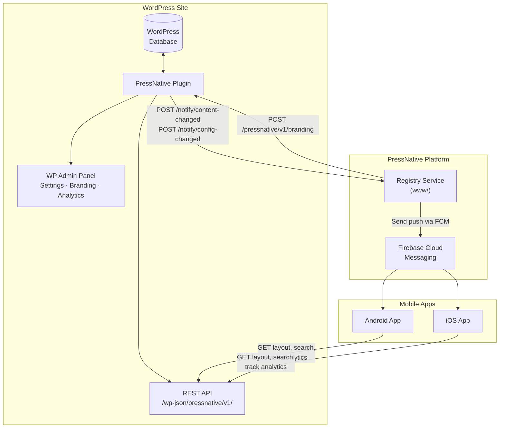
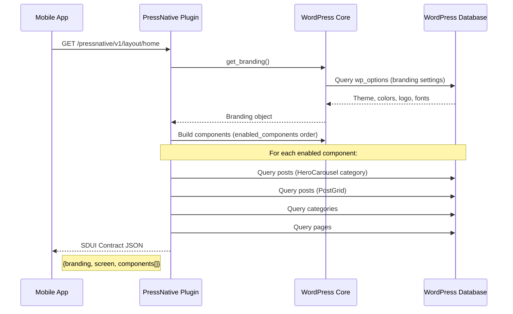
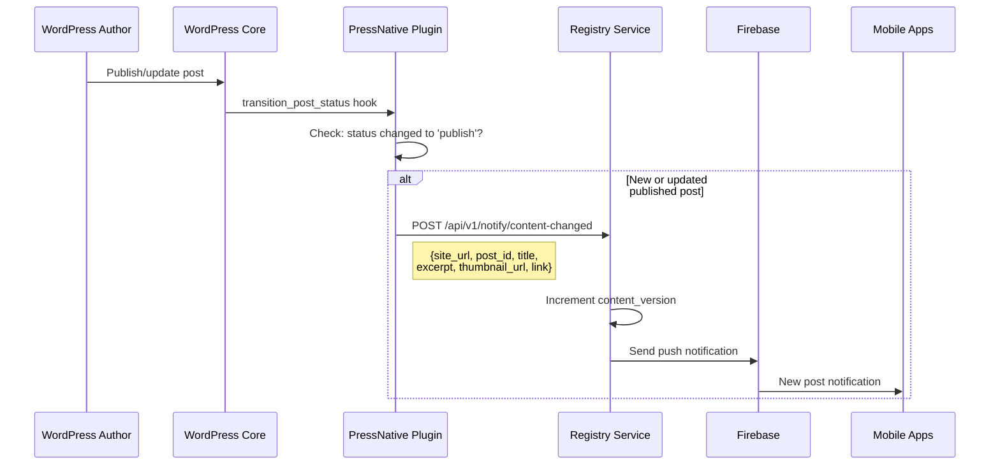
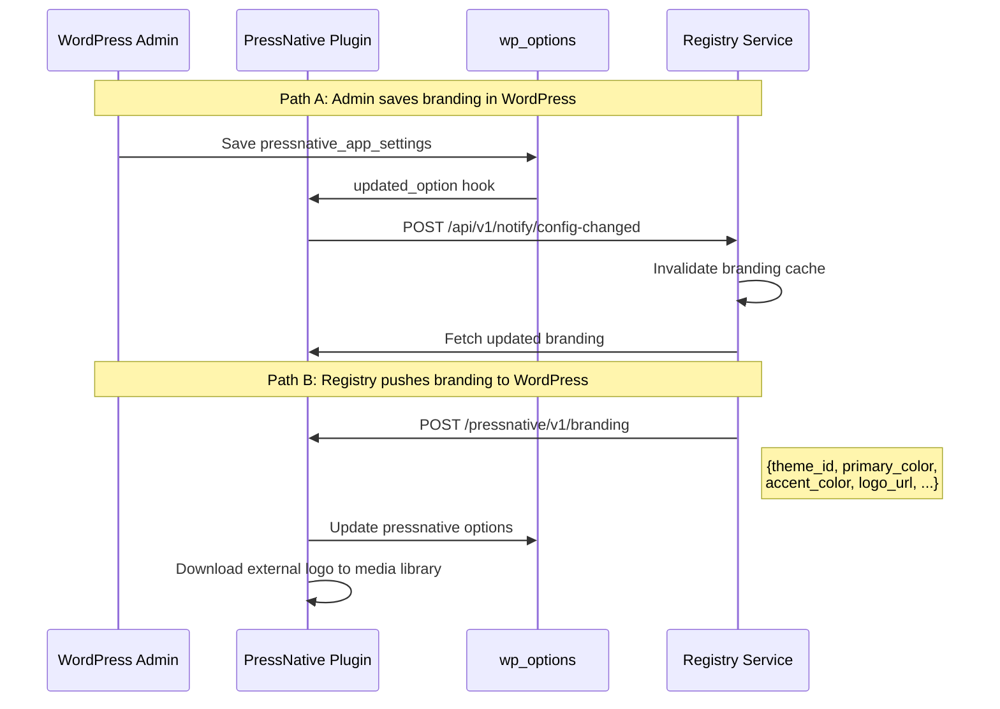
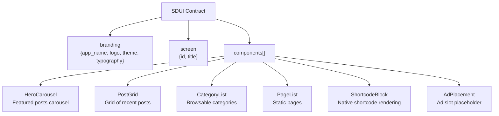
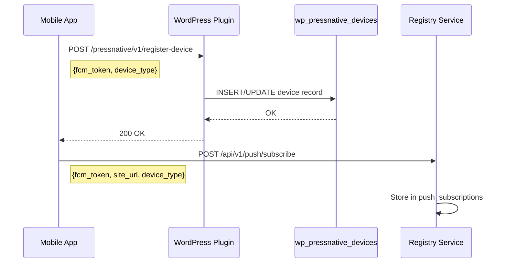
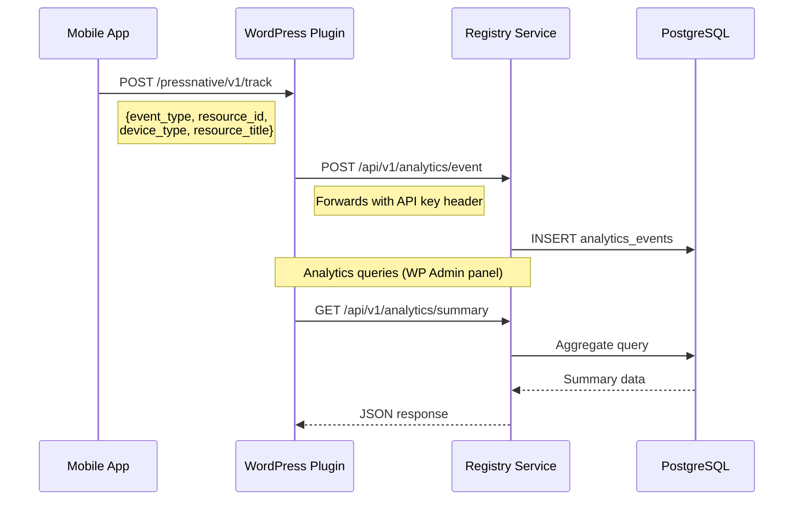

# PressNative WordPress Plugin &mdash; Architecture

The PressNative plugin is the **data provider** layer. It transforms WordPress content into a Server-Driven UI (SDUI) contract that native mobile apps consume, and bridges WordPress with the central Registry service for push notifications, analytics, and billing.

---

## Where the Plugin Fits



---

## Data Flow: Layout Request (Mobile App &rarr; Plugin)

When a mobile app requests the home screen, the plugin assembles the SDUI contract from WordPress data.



---

## Data Flow: Content Change Notification

When an author publishes or updates content, the plugin notifies the Registry, which triggers push notifications to subscribed devices.



---

## Data Flow: Branding & Config Sync

Branding changes flow **bidirectionally** between the WordPress admin and the Registry admin panel.



### Tracked Options (trigger Registry notification)

| Category | Options |
|----------|----------|
| **Branding** | app_name, primary_color, accent_color, background_color, text_color, font_family, base_font_size, logo_attachment, theme_id |
| **Layout** | hero_category_slug, hero_max_items, post_grid_columns, post_grid_per_page, enabled_categories, enabled_components |

---

## SDUI Contract Structure

The plugin serves layouts that match the `contract.json` schema defined in the Registry.



### Contract JSON Example

```json
{
  "branding": {
    "app_name": "My Site",
    "logo_url": "https://example.com/logo.png",
    "theme_id": "editorial",
    "theme": {
      "primary_color": "#1a1a2e",
      "accent_color": "#e94560",
      "background_color": "#ffffff",
      "text_color": "#1a1a2e"
    },
    "typography": {
      "font_family": "sans-serif",
      "base_font_size": 16
    }
  },
  "screen": { "id": "home", "title": "My Site" },
  "components": [
    { "id": "hero", "type": "HeroCarousel", "content": { "items": [...] } },
    { "id": "posts", "type": "PostGrid", "content": { "posts": [...], "columns": 2 } },
    { "id": "categories", "type": "CategoryList", "content": { "categories": [...] } }
  ]
}
```

---

## Device Registration Flow

Mobile apps register their Firebase token with both the WordPress plugin (local storage) and the Registry (push subscriptions).



---

## Analytics Flow

Analytics events originate from mobile apps, pass through the plugin, and are stored in the Registry.



---

## REST API Reference

### Layout Endpoints

| Method | Path | Description |
|--------|------|-------------|
| `GET` | `/pressnative/v1/layout/home` | Home screen SDUI layout |
| `GET` | `/pressnative/v1/layout/post/{id}` | Post detail layout |
| `GET` | `/pressnative/v1/layout/page/{slug}` | Page layout by slug |
| `GET` | `/pressnative/v1/layout/category/{id}` | Category layout |

### Content & Search

| Method | Path | Description |
|--------|------|-------------|
| `GET` | `/pressnative/v1/search?q=&per_page=` | Search posts |
| `POST` | `/pressnative/v1/preview` | Preview layout with temporary overrides |

### Device & Notifications

| Method | Path | Description |
|--------|------|-------------|
| `POST` | `/pressnative/v1/register-device` | Register FCM token |
| `POST` | `/pressnative/v1/branding` | Registry pushes branding updates |
| `GET` | `/pressnative/v1/site-info` | Site metadata for Registry |

### Analytics

| Method | Path | Description |
|--------|------|-------------|
| `POST` | `/pressnative/v1/track` | Forward analytics event to Registry |
| `GET` | `/pressnative/v1/analytics/summary` | Summary stats (admin) |
| `GET` | `/pressnative/v1/analytics/top-posts` | Top posts by views |
| `GET` | `/pressnative/v1/analytics/top-pages` | Top pages by views |
| `GET` | `/pressnative/v1/analytics/top-categories` | Top categories |
| `GET` | `/pressnative/v1/analytics/views-over-time` | Time series views |
| `GET` | `/pressnative/v1/analytics/device-breakdown` | Device type stats |
| `GET` | `/pressnative/v1/analytics/top-searches` | Top search queries |

---

## WordPress Hooks

### Actions

| Hook | Handler | Purpose |
|------|---------|----------|
| `transition_post_status` | `maybe_notify_content_changed()` | Notify Registry on publish |
| `updated_option` | `maybe_notify_registry()` | Notify Registry on config change |
| `rest_api_init` | Register all REST routes | Expose REST API |
| `admin_menu` | Register admin pages | Add WP admin panel |
| `template_redirect` | Handle `?pressnative=1` | WebView content rendering |

### Filters

| Filter | Purpose |
|--------|----------|
| `pressnative_search_results` | Override search results |
| `pressnative_native_shortcodes` | Register native shortcode mappings |
| `pressnative_qr_deep_link_base` | Override QR code deep link URL |

---

## Admin Panel Features

| Page | Purpose |
|------|----------|
| **Settings** | Registry URL, API key, subscription status |
| **App Settings** | Theme presets, colors, logo, typography |
| **Layout Settings** | Component order, hero category, grid config |
| **Analytics** | Charts & stats (proxied from Registry) |
| **Push Notifications** | Send ad-hoc push notifications |

### Theme Presets

| Theme | Primary | Accent | Background | Text |
|-------|---------|--------|------------|------|
| Editorial | #1a1a2e | #e94560 | #ffffff | #1a1a2e |
| Midnight | #0d1b2a | #e0e1dd | #1b263b | #e0e1dd |
| Citrus | #2d6a4f | #f77f00 | #ffffff | #264653 |
| Ocean | #023e8a | #48cae4 | #f8f9fa | #023047 |
| Minimal | #212529 | #212529 | #ffffff | #212529 |
| Custom | User-defined | User-defined | User-defined | User-defined |
