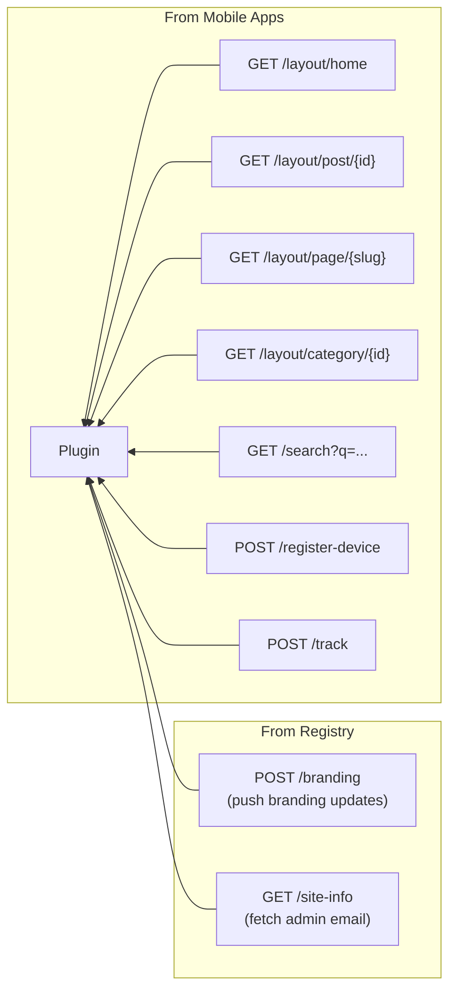
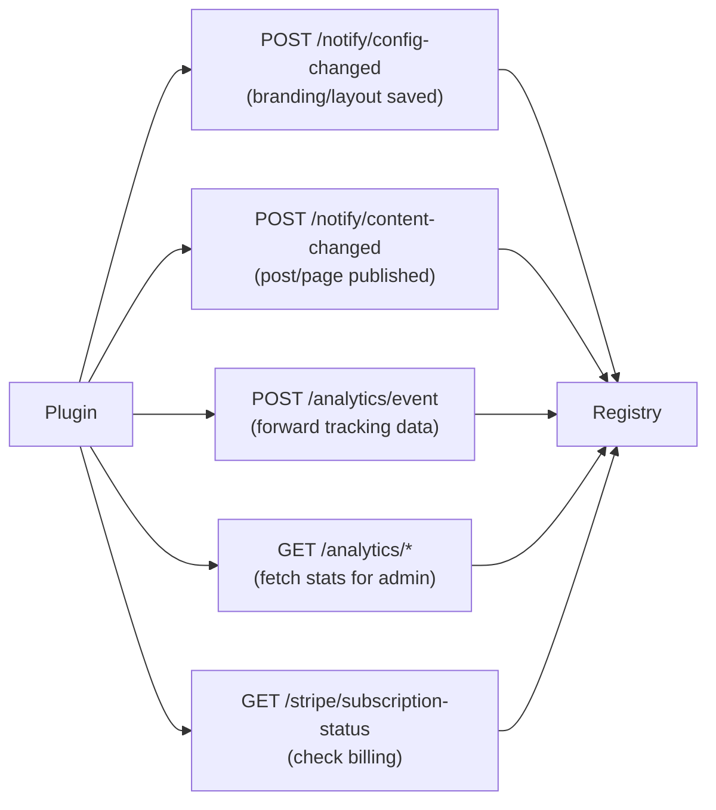

# Plugin Data Flow Reference

Quick reference for every data exchange involving the PressNative WordPress plugin.

---

## Inbound Requests (to Plugin)

## Outbound Requests (from Plugin)

---

## Plugin Database Table

The plugin creates one custom table on activation:

| Table | Columns | Purpose |
|-------|---------|----------|
| `wp_pressnative_devices` | id, fcm_token (unique), device_type, created_at, updated_at | Local FCM token storage |

All other data uses standard `wp_options`:

| Option Key | Purpose |
|------------|----------|
| `pressnative_registry_url` | Registry service URL |
| `pressnative_api_key` | API key for Registry auth |
| `pressnative_app_name` | App display name |
| `pressnative_primary_color` | Brand primary color |
| `pressnative_accent_color` | Brand accent color |
| `pressnative_background_color` | Background color |
| `pressnative_text_color` | Text color |
| `pressnative_font_family` | Typography font family |
| `pressnative_base_font_size` | Typography base size |
| `pressnative_logo_attachment` | Logo media attachment ID |
| `pressnative_hero_category_slug` | Hero carousel category |
| `pressnative_hero_max_items` | Max hero items |
| `pressnative_post_grid_columns` | Post grid column count |
| `pressnative_post_grid_per_page` | Posts per page |
| `pressnative_enabled_categories` | Enabled category IDs |
| `pressnative_enabled_components` | Component order list |
